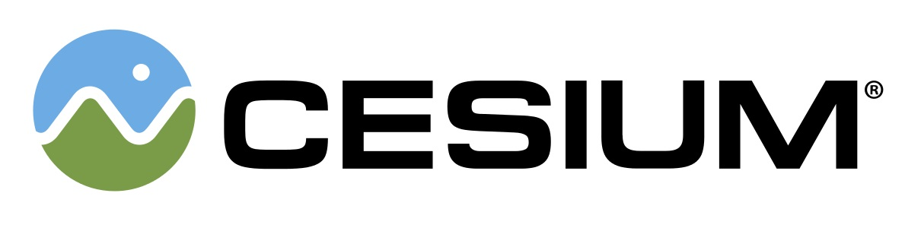
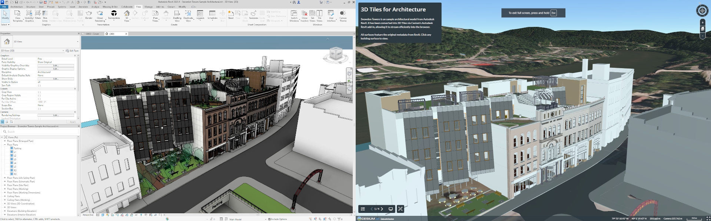
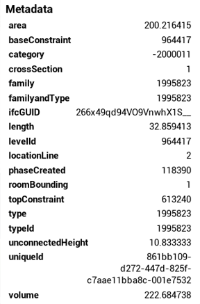

  

#  Cesium ion for Autodesk Revit

<!--TOC-->
  - [Overview](#overview)
  - [Installation](#installation)
  - [Usage](#usage)
    - [Connect to Cesium ion](#connect-to-cesium-ion)
    - [Upload 3D Tiles](#upload-3d-tiles)
    - [Export Preferences](#export-preferences)
      - [Georeferencing](#georeferencing)
      - [Options](#options)
    - [Exporting with Georeferencing](#exporting-with-georeferencing)
    - [Materials and Textures](#materials-and-textures)
    - [Metadata](#metadata)
    - [Current Limitations or Known Issues](#current-limitations-or-known-issues)
<!--/TOC-->

## Overview

Cesium ion for Autodesk Revit enables you to effortlessly export your designs to Cesium ion and stream them as 3D Tiles to CesiumJS and other applications.

By leveraging Cesium ion and the power of 3D Tiles, even multi-gigabyte models can be streamed to any device without having to download the entire tileset up front. By visualizing 3D Tiles with CesiumJS, you can fuse your models with other datasets, add geospatial context to place it at a real world location, or overlay additional details and analysis.

Autodesk Revit versions 2022 to 2026 are supported.

For Cesium clients, we recommend using Cesium for Unreal v2.11.0 or later, Cesium for Unity v1.14.0 or later, and CesiumJS v1.124.0 or later

Learn more at https://cesium.com.

    Snowdon Towers (left) loaded into Autodesk Revit and (right) fused with Cesium World Terrain and imagery in CesiumJS after being tiled with ion.

## Installation

The add-in can be installed by downloading and running the installer from the Autodesk App Store.

[Cesium ion for Autodesk Revit on Autodesk App Store](https://apps.autodesk.com/RVT/en/Detail/Index?id=6447681920168081779&appLang=en&os=Win64)

For development, see [Developer Guide](./Documentation/DeveloperGuide/README.md)

## Usage

### Connect to Cesium ion

Open the **Cesium ribbon** and click **Connect** to connect to Cesium ion.  

Choose your Cesium ion server and follow the sign in prompts to complete sign in.

### Upload 3D Tiles

Navigate to a 3D View and ensure the content visible is what you want uploaded.

Open the **Cesium ribbon** and click **Upload** to begin uploading to Cesium ion.

Review the preferences and click **Save**. For more information, see the **Export Preferences** section below.

Once upload has completed, click **Open in Cesium ion** to view your design as 3D Tiles.

### Export Preferences

The following preferences control the content exported to 3D Tiles:

#### Georeferencing
  * **Shared Coordinates** - Positions the geometry relative to Revit’s shared coordinates and aligned to True North.
  * **Internal Origin** - Positions the geometry relative to Revit’s Internal Origin.

**NOTE**: For more information on using georeferencing, see the _Exporting with Georeferencing_ section below.

#### Options
  * **Normals** - Exports surface normals for geometry.
  * **Materials** - Exports materials using color values from Revit.
  * **Textures** - Exports color textures for materials if present.
  * **Max Size** - Resizes textures to a maximum resolution, which can help reduce memory usage.
  * **Metadata** - Includes Revit properties as metadata.
  * **GPU Instancing** - Detects and uses GPU instancing for eligible geometry on export. This can optimize rendering performance and reduce memory usage. Currently, GPU instancing is supported by CesiumJS and Cesium for Unreal, with support for Cesium for Unity and Cesium for Omniverse coming soon.
  * **Revit Links** - Exports geometry for Revit files linked to the project.

### Exporting with Georeferencing

For Revit projects located within a geospatial Coordinate Reference System (CRS), the following prerequisites are needed:

* The EPSG code corresponding to the project’s CRS.
* The project must use shared coordinates that accurately position the project within the CRS.

For example, the Snowdon sample provided with Autodesk Revit is located in the NAD83 / Pennsylvania South (ftUS) CRS, which is EPSG:2272. Elevations are relative to the EGM96 geoid (EPSG:5773). To automatically place this on the globe during tiling, you would:

1. Select _Shared Coordinates_ in the preferences window.
2. Set the EPSG code to `2272+5773`.

If your project does not use Shared Coordinates or if you do not know the EPSG code for its CRS, you can export using _Internal Origin_ and manually position the data on the globe when uploading to Cesium ion.

### Materials and Textures

When exporting with materials, the following values will be used:

* Base Color RGB
* Base Color Texture
* Opacity

**NOTE**: Revit has various material configurations, and some information may not currently be supported.

### Metadata

All parameters associated with each specific Element in the 3D View are exported as metadata. This includes both instance parameters (specific to an element instance) and type parameters (common to all instances of a given type).

### Current Limitations or Known Issues

* Instancing is currently supported in CesiumJS and Cesium for Unreal, with support for Cesium for Unity and Cesium for Omniverse coming soon.
* 3D Tiles containing textures may experience excessive GPU RAM usage in Cesium for Unreal. Exporting with smaller texture sizes may help. Improved support for textures is coming soon.
* Some elements visible in the 3D View are not represented with polygons and subsequently may not export as geometry. Exporting IFC may provide an alternative workflow.
