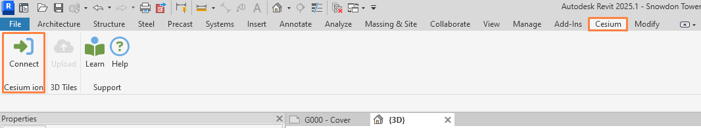

  

#  Cesium ion Revit Add-in

The Cesium ion Revit Add-in enables you to effortlessly export your designs to Cesium ion and stream them as 3D Tiles to CesiumJS and other applications.

By leveraging Cesium ion and the power of 3D Tiles, even multi-gigabyte models can be streamed to any device without having to download the entire tileset up front. By visualizing 3D Tiles with CesiumJS, you can fuse your models with other datasets, add geospatial context to place it at a real world location, or overlay additional details and analysis.

Revit versions 2022 to 2025 are supported.

Learn more at https://cesium.com.

    Snowdon Towers (left) loaded into Autodesk Revit and (right) fused with Cesium World Terrain and imagery in CesiumJS after being tiled with ion.

## Installation and Usage

The add-in can be installed by downloading and running the installer from the Autodesk App Store.

[Cesium ion Revit Add-in on Autodesk App Store](https://apps.autodesk.com/RVT/en/Home/Index)

TODO: Update link above once published

TODO: Add screenshot of app page once published

For development, see [Developer Guide](./Documentation/DeveloperGuide/README.md)

## Tutorial

Open an Autodesk Revit project

Open the **Cesium ribbon** and click **Connect** to connect to Cesium ion.  

Choose your Cesium ion server and follow the sign in prompts to complete sign in.

Navigate to a 3D View and ensure the content visible is what you want uploaded.

On the **Cesium ribbon** click **Upload** to begin uploading to Cesium ion.

Review and adjust preferences if required, then click **Upload.**

Once upload has completed, click **Open in Cesium ion** to view your design as 3D Tiles.

## Contributing

Interested in contributing? See [CONTRIBUTING.md](CONTRIBUTING.md). :heart: